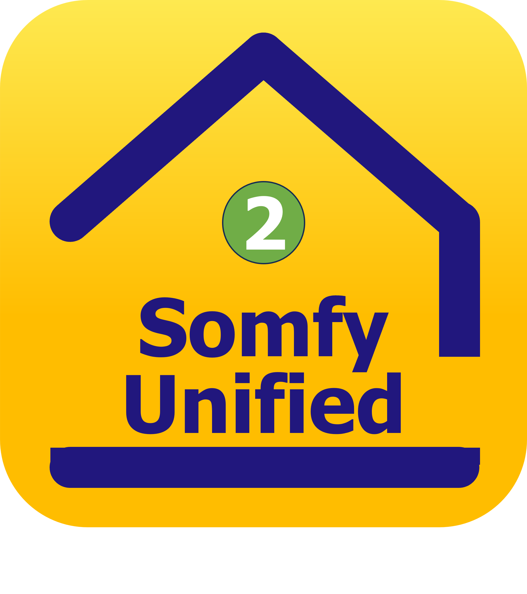

# Plugins
# SomfyUnified - SomfyUnifiedExt1 - SomfyUnifiedExt2

 &nbsp; &nbsp;  &nbsp; &nbsp; 

| Plugin             | Version applicable |
| :----------------: | :----------------: |
| _SomfyUnified_     | _3.3.3_            |
| _SomfyUnifiedExt1_ | _2.1.0_            |
| _SomfyUnifiedExt2_ | _1.0.0_            |

_Updated 2026 0128_

## Presentation SomfyUnified
Le plugin **SomfyUnified** est destiné à permettre une interface entre Jeedom et les équipements de l'écosystème Somfy. 
Il supporte actuellement deux types d'équipements:
1) Equipements connectés nécessairement via une box/gateway compatible (TaHoma, Cozytouch, ...) (utilisent les API OverKiz) 
2) Equipements connectés via WiFi Direct (+) (utilisent l'API dédiée) 

(+) _Ces équipement possèdent leur propre connexion WiFi et l'équivalent de la box/gateway est en fait intégrée à l'équipement._ 

Les serveurs accesibles sont listés ci-dessous:

>- **Somfy TaHoma Cloud**
>- **Somfy TaHoma Local**
>- **Atlantic Cozytouch**
>- **Thermor Cozytouch**
>- **Daikin**
>- ~~Brandt Smart Control~~ (Changement d'API, ce serveur n'est plus supporté)
>- **Flexom**
>- **Hexaom HexaConnect**
>- **Hitachi Hi Kumo**
>- **Nexity Eugénie**
>- ~~Rexel Energeasy Connect~~ (Changement d'API, ce serveur n'est plus supporté)
>- **Simu (LiveIn2)**
>- **Ubiwizz**

### SOMFY: liste des matériels compatibles TaHoma
Pour accompagner la sortie de son dernier firmware, Somfy a éditer une liste très complète des matériels compatibles TaHoma dont je vous joins ici le lien:

[Equipements compatibles Somfy TaHoma](https://assets3.keepeek.com/medias/domain7918/_permalinks/SEO/media75513/somfy-solution-connectee-box-liste-compatibilites-tahoma.pdf)

Après avoir été appairés via l’App TaHoma Somfy, ces matériels deviennent donc potentiellement pilotables via le plugin SomfyUnified.

Pour les utilisateurs ou futurs utilisateurs du plugin , je vous invite à vérifier si vos matériels peuvent être ainsi pilotés par Jeedom.

Voir liste détaillée des équipements déja inclus dans la base de configuration en fin de documentation.

## Presentation SomfyUnifiedExt1
Le plugin **SomfyUnifiedExt1** est une extension du plugin **SomfyUnified**. Attention, ce dernier doit être installé préalablement à l'extension. 
Il est dédié uniquement aux équipements appartenant aux familles: 
- **HeatingSystem** 
- **HitachiHeatingSystem** 
- **WaterHeatingSystem** 

## Presentation SomfyUnifiedExt2
Le plugin **SomfyUnifiedExt2** est une extension du plugin **SomfyUnified**. Attention, ce dernier doit être installé préalablement à l'extension. 
Il est dédié uniquement aux équipements appartenant aux familles: 
- **VentilationSystem** 

Les plugins **SomfyUnifiedExt1** et **SomfyUnifiedExt2**: 
1) fournissent des widgets et/ou panels/consoles spécifiques 
2) regroupent sur une même interface les équipements logiques d'un même équipement physique (exemple: une PAC peut remonter sous Jeedom jusqu'à 10 équipements logiques) 

### WiFi Direct
A partir de la version 2.0 et par extension, il prend également en charge les équipements pilotables par **WiFi Direct** et qui ne nécessitent pas une Box/Gateway pour se connecter au serveur. 

**Notice** 
La connection des équipements avec connections via NaviClim, Navilink est également supportée.

## Caractéristiques
### Gestion multi-serveurs

Basé sur une gestion multi-serveurs, le plugin **SomfyUnified** remonte, crée et gère la totalité des commandes et informations disponibles auprès des serveurs enregistrés et configurés par l'utilisateur.

### Retour d'état instantané
En fonctionnement opérationnel, la prise en compte d'une commande reçue par l'équipement sera suivie par une **mise à jour instantanée** de l'état/info correspondant (1). 
Ce retour d'état instantané assure à l'utilisateur un réel confort d'utilisation et de programmation de ses équipements. 
Le retour d'état est opérationnel avec les serveurs de type cloud et local. 
Le retour d'état instantané n'est pas disponible sur les serveurs de type wifi.

(1) _Sauf si l'information n'était pas mise à disposition par le serveur_

### Gestion des Scénarios (crées dans l'App)

Si des scénarios ont été programmés au niveau de l'app  constructeur, le plugin permet de les exécuter.
Pour chaque serveur, la liste des scénarios se trouve dans l'équipement `serverScenarios_server` et sous forme d'une liste dans la commande `serverScenarioList`.
Si la commande info `serverScenarioTimestamp` est égale à 0 ou contient une date Timestamp non valide, c'est à dire, correspondant à une date passée par rapport à maintenant, le scénario sera déclanché immédiatement.
Si la commande info `serverScenarioTimestamp` contient une date valide (au format Unix Timestamp), le scénario sera alors déclanché à cette date.

La liste des scénarios est mise à jour en même temps que les données Info des équipements (synchronisé par le cron Cloud).

**Notes** 
TaHoma Cloud: seuls les scénarios de type **Manuel** sont remontés par l'API. 
TaHoma Local: la gestion des scénarios n'est pas supportée par l'API locale (serveur Local).

### Adaptabilité et évolutivité à l'écosystème

L'écosystème géré par le plugin **SomfyUnified** comprend, à ce jour, de nombreux partenaires et est susceptible de continuer à s'étoffer et évoluer. 
Cela signifie qu'une box des familles de l'écosystème (TaHoma, Cozytouch, ...) peut s'interfacer à de nombreux dispositifs très différents les uns des autres pour les piloter.
On trouve actuellement dans l'écosystèmes le contrôle de dispositifs tels que des systèmes de controle d'ouverture ou fermeture d'ouvrants (volets roulants, portes, stores, ...), des systèmes d'alarme, des systèmes de chauffage et climatisation, ... 

L'absence de documentation de la part de Somfy sur les commandes des dispositifs rend la syntaxe de ces opérations particulièrement difficile à anticiper et implémenter dans un plugin et ce, à priori. 

Afin de s'adapter à une telle diversité de commandes ou données potentielles, le plugin gère les différents équipements à partir de fichiers de configurations propres à chaque équipement regroupés dans une Base de Connaissance (BDC) du plugin. 

La liste des équipements dont le fichier de configuration est intégré au plugin est donnée en fin de ce document.

### Compatibilité Debian

Le plugin **SomfyUnified** est compatible des systèmes fonctionnant sous: 
- Debian 11 
- Debian 12 

## Statut de validation du plugin

Compte-tenu de la grande diversité d'équipements susceptibles d'être gérés par le plugin, il est impossible, pour le développeur, d'avoir pu valider tous les types d'équipements. 
Les validations se feront donc au fur et à mesure de l'adoption du plugin par les utilisateurs qui accepteront de tenter son intégration.

Compte-tenu de l'état d'avancement, l'état de validation des différentes familles d'équipements est donné dans le tableau suivant:

| Equipement                 |  Type API  |  Etat de validation |
| :------------------------- | :--------: | :-----------------: |
| Somfy TaHoma Cloud (2)     | cloud      | validé              |
| Somfy TaHoma Local         | local      | validé              |
| Cozytouch (3)              | cloud      | validé              |
| Daikin (2)                 | cloud      | validé              |
| Hitachi Hi Kumo            | cloud      | validé              |
| Velux (2)                  | cloud      | validé              |
| BFt (EasyAXS)              | cloud      | à confirmer         |
| Flexom                     | cloud      | à confirmer         |
| Hexaom HexaConnect         | cloud      | à confirmer         |
| Nexity Eugénie             | cloud      | à confirmer         |
| Simu (LiveIn2)             | cloud      | à confirmer         |
| Ubiwizz                    | cloud      | à confirmer         |

(2) _Daikin, Velux (via Somfy TaHoma)_ 
(3) _Atlantic, Sauter (Gen1), Thermor_

## Feuille de route

Dans l'état actuel du plugin, les fonctionnalités suivantes sont prévues mais non encore opérationnelles:
1. Le plugin est en langue EN, la version FR sera disponible dans une version ultérieure.
2. D'une façon générale avec le plugin SomfyUnified, pas de widgets spécifiques associés aux commandes. Dans certains cas, des widgets dédiés sont appliqués sinon les widgets du core Jeedom s'appliquent.

## Evolution des politiques Somfy et partenaires tiers
L'entité Jeedom ainsi que le concepteur du plugin **SomfyUnified** et ses extensions ne pourront, en aucun cas et d'aucune manière, être tenus responsables d'une évolution des politiques Somfy et partenaires tiers qui conduirait à :
- une évolution significative des APIs rendant le plugin inopérant, ou
- à la suppression de l'accès, par Somfy et/ou partenaires tiers, aux APIs telles qu'elles étaient définies lors de la conception du plugin et de ses extensions.

## Utilisation
### API locale Somfy

L'utilisation du serveur local de votre gateway Somfy nécessite que vous ayez au préalable créé un Token d'authentification à partir de la page du plugin prévue à cet effet. 
La gateway Somfy a la capacité d'enregistrer et de conserver plusieurs tokens. 
Le plugin propose les fonctionalités de gestion des token de votre gateway (création avec label utilisateur, suppression).

### API locale en mode IP

Le mode IP est à utiliser lorsqu'un système DNS dans votre configuration ne résoud pas les hostnames de type **.local**. 
C'est le cas en particulier lorsque vous utilisez une box Jeedom Atlas. 
Le mode IP peut être activé lors de la création ou mise à jour d'un serveur de type **Local**. 
Lorsque le Mode IP est activé, la vérification SSL est obligatoirement et automatiquement désactivée (verifySSL = No). 

### Utilisation des Logs

Attention, les Logs `Debug` et `Info` génèrent beaucoup d'informations. Ces modes ne sont à utiliser que pour entrer en analyse du plugin et pendant des courtes périodes. 
Lors du fonctionnement normal, positionner les Logs en mode `Defaut`.

### Crons

En fonctionnement normal, les Crons `cron`, `cron10` et `cron30` doivent être activés.

### Utilisation des commandes user

...

### Suppression d'un serveur

La suppression d'un serveur (onglet Manage Servers) supprime le serveur de la configuration du plugin mais ne SUPPRIME PAS les équipements qui auraient déja été créés sur ce serveur. 
En effet, la suppression d'un équipement peut avoir de nombreuses répercutions sur une configuration utilisateur. 
C'est pour cela que, dans le plugin SomfyUnified, la suppression d'un équipement est laissée uniquement à l'initiative d'une opération réalisée manuellement par l'utilisateur.

## FAQ

1. **Mon équipement a été créé mais il n’y a aucune commande qui apparait ?** 
L’équipement n’est pas (encore) intégré dans la base de donnée (BdD) du plugin (voir ci-dessous). 
A l’aide de l’explorateur de fichier Jeedom, se rendre dans le répertoire: 
`plugins/SomfyUnified/userData/components/` 
Créer une archive .zip du répertoire **undefined** puis la renommer en y ajoutant .txt à la fin. Envoyer ce fichier créer au concepteur du plugin (en MP) afin que l’équipement puisse être inclus à la BdD du plugin SomfyUnified.

2. **Je souhaite piloter des équipements controlés par une box qui ne se trouvent pas sur le même réseau local (LAN) que celui qui gère mon Jeedom.** 
C'est le cas d'équipements situés dans une résidence secondaire par exemple. Oui, cela est possible en gérant vos équipements via le serveur CLOUD associé. Dans ce cas, votre box n'apparaitra pas dans le panel "Local IoT Gateways".

3. **Puis-je enregistrer et gérer plusieurs serveurs avec mon plugin SomfyUnified ?.** 
Oui, le plugin **SomfyUnified** assure la gestion de tous les serveurs enregistrés par l'utilisateur et choisis dans la liste du menu "Manage Servers" et correctement configurés. 
Une configuration classique pourrait être: Somfy TaHoma CLOUD + Somfy TaHoma LOCAL + Cozytouch CLOUD.

4. **Sur mon Jeedom, puis-je gérer des équipements Somfy TaHoma qui ne sont pas reconnus par l'API Somfy Local ?.** 
Comme le plugin **SomfyUnified** assure la gestion de tous les serveurs enregistrés, il est possible de gérer ses équipements Somfy TaHoma en local pour profiter de l'avantages mode Cloudless et d'avoir accès également via le serveur CLOUD aux autres équipements non reconnus par votre box TaHoma en local. 

## Liste des équipements en BdD du plugin (Cozytouch WiFi Direct)

A cette date, l'inclusion des équipements suivant (2) a été effectuée:

| Type Equipement            |  Identifiant Equipement                                                 | Constructeur      |
| :------------------------- | :---------------------------------------------------------------------- | :---------------- |
| Gaz Boiler                 | NAEMA 3 Duo 25 (1)                                                      | Atlantic          |
| Heat Pump                  | HYBRELLIA (1)                                                           | Atlantic          |
|                            | SHOGUN NAVIZONE                                                         | Atlantic          |
| Towel Rack                 | ASAMA                                                                   | Sauter            |
|                            | DORIS                                                                   | Atlantic          |
|                            | KELUD                                                                   | Sauter            |
|                            | NEFERTITI                                                               | Atlantic          |
|                            | RIVA 5                                                                  | Thermor           |
| Water Heater               | AQUEO (150L & 200L)                                                     | Atlantic          |
|                            | CALYPSO Split                                                           | Atlantic          |
|                            | CALYPSO Trineo                                                          | Atlantic          |
|                            | PHASY                                                                   | Sauter            |
|                            | AEROMAX SPLIT 3                                                         | Thermor           |
|                            | DURALIS Connect                                                         | Thermor           |

(1) _via Atlantic Navilink 128 (Thermostat modulant connecté)_ 
(2) Dans chaque famille, certains modeles uniquement car leur identifiant depand du modele, de la puissance, de la forme, de la couleur, etc ...

## Liste des équipements en BdD du plugin (API Overkiz)

A cette date, l'inclusion des équipements suivant a été effectuée:

| Type Equipement            |  Identifiant Equipement                                                 | Constructeur      | Action | Info   |
| :------------------------- | :---------------------------------------------------------------------- | :---------------- | :----- | :----- |
| AirSensor                  | io:CO2IOSystemDeviceSensor                                              | Atlantic          | 0      | 11     |
| Alarm                      | internal:TSKAlarmComponent                                              | Somfy             | 14     | 9      |
|                            | io:AlarmIOComponent                                                     |                   |        |        |
|                            | myfox:SomfyProtectAlarmController                                       | Somfy             | 6      | 12     |
| Awning                     | io:AwningValanceIOComponent                                             |                   |        |        |
|                            | io:HorizontalAwningIOComponent                                          |                   |        |        |
|                            | ogp:Awning                                                              |                   |        |        |
|                            | rts:HorizontalAwningRTSComponent                                        |                   |        |        |
| CarbonDioxideSensor        | netatmo:CO2Component                                                    | Legrand Netatmo   |        |        |
| ConfigurationComponent     | netatmo:ConfigurationComponent                                          | Legrand Netatmo   |        |        |
|                            | netatmo:HomeController                                                  | Legrand Netatmo   |        |        |
|                            | netatmo:WeatherStationConfigurationComponent                            | Legrand Netatmo   |        |        |
|                            | zigbee:SomfyConfigurationToolComponent                                  | Somfy             | 15     | 28     |
| ConsumptionSensor          | io:DHWRelatedFossilEnergyConsumptionSensor                              |                   |        |        |
|                            | io:HeatingRelatedFossilEnergyConsumptionSensor                          |                   |        |        |
|                            | io:TotalFossilEnergyConsumptionSensor                                   |                   |        |        |
| ContactSensor              | io:ContactIOSystemDeviceSensor                                          |                   |        |        |
|                            | io:SomfyContactIOSystemSensor                                           |                   |        |        |
|                            | rtds:RTDSContactSensor                                                  |                   |        |        |
|                            | zigbee:DoorSensorComponent                                              |                   |        |        |
| Dock                       | internal:TSKDockComponent                                               |                   |        |        |
| DoorLock                   | myfox:SomfyProtectDoorLock                                              | Somfy             | 3      | 10     |
| ElectricitySensor          | io:AirConditioningElectricalEnergyConsumptionSensor                     |                   |        |        |
|                            | io:CoolingRelatedElectricalEnergyConsumptionSensor                      | Atlantic          | 0      | 22     |
|                            | io:CumulatedElectricalEnergyConsumptionIOSystemDeviceSensor             |                   |        |        |
|                            | io:DHWCumulatedElectricalEnergyConsumptionIOSystemDeviceSensor          |                   |        |        |
|                            | io:DHWElectricalEnergyConsumptionSensor                                 |                   |        |        |
|                            | io:DHWRelatedElectricalEnergyConsumptionSensor                          |                   |        |        |
|                            | io:ElectricityMeterComponent                                            |                   |        |        |
|                            | io:EnergyConsumptionSensorsConfigurationComponent                       |                   |        |        |
|                            | io:EnergyConsumptionSensorsHeatPumpComponent                            |                   |        |        |
|                            | io:HeatingElectricalEnergyConsumptionSensor                             |                   |        |        |
|                            | io:HeatingRelatedElectricalEnergyConsumptionSensor                      |                   |        |        |
|                            | io:OtherElectricalEnergyConsumptionSensor                               |                   |        |        |
|                            | io:PlugsElectricalEnergyConsumptionSensor                               |                   |        |        |
|                            | io:TotalElectricalEnergyConsumptionIOSystemSensor                       |                   |        |        |
|                            | io:TotalElectricalEnergyConsumptionSensor                               |                   |        |        |
|                            | modbuslink:DHWCumulatedElectricalEnergyConsumptionMBLSystemDeviceSensor | Atlantic, Thermor | 1      | 18     |
|                            | modbus:YutakiV2DHWElectricalEnergyConsumptionComponent                  | Hitachi           |        | 8      |
|                            | modbus:YutakiV2SpaceHeatingElectricalEnergyConsumptionComponent         | Hitachi           |        | 8      |
|                            | zigbee:LinkyRadioTransmitterSensorComponent                             | Somfy             | 6      | 46     |
| ExteriorScreen             | io:VerticalExteriorAwningIOComponent                                    |                   |        |        |
| ExteriorVenetianBlind      | io:ExteriorVenetianBlindIOComponent                                     |                   |        |        |
|                            | rts:ExteriorVenetianBlindRTSComponent                                   |                   | 13     | 7      |
| GarageDoor                 | io:DiscreteGarageOpenerIOComponent                                      |                   | 24     | 20     |
|                            | io:DiscreteGarageOpenerWithPartialPositionIOComponent                   | Somfy             | 29     | 20     |
|                            | io:GarageOpenerIOComponent                                              |                   | 25     | 21     |
|                            | ogp:GarageDoor                                                          |                   |        |        |
|                            | rts:GarageDoorWithVentilationPositionRTSComponent                       |                   | 10     |        |
|                            | rts:GarageDoor4TRTSComponent                                            |                   | 3      | 6      |
|                            | rts:SlidingGarageDoorWithPedestrianPositionRTSComponent                 |                   | 10     | 7      |
| Gate                       | io:DynamicGateIOComponent                                               | Somfy             | 26     | 26     |
|                            | io:SlidingDiscreteFullyPedestriableGateOpenerIOComponent                |                   |        |        |
|                            | io:SlidingDiscreteGateOpenerIOComponent                                 |                   |        |        |
|                            | ogp:Gate                                                                |                   | 4      | 14     |
|                            | rts:GateOpenerRTSComponent                                              |                   | 9      |        |
|                            | rts:GateOpenerRTS4TComponent                                            |                   | 3      | 6      |
|                            | rts:SlidingGateOpenerRTSComponent                                       |                   |        |        |
| Generic                    | ovp:ModbusMainController                                                | Hitachi           | 3      | 8      |
| HeatingSystem              | io:AtlanticElectricalHeaterIOComponent                                  | Atlantic          |        |        |
|                            | io:AtlanticElectricalHeaterWithAdjustableTemperatureSetpointIOComponent | Atlantic          |        |        |
|                            | io:AtlanticElectricalTowelDryerIOComponent                              | Atlantic          |        |        |
|                            | io:AtlanticElectricalTowelDryer_IC3_IOComponent                         | Atlantic          |        |        |
|                            | io:AtlanticPassAPCBoilerMainComponent                                   | Atlantic          |        |        |
|                            | io:AtlanticPassAPCHeatingAndCoolingZoneComponent                        | Atlantic          | 28     | 28     |
|                            | io:AtlanticPassAPCHeatingZoneComponent                                  | Atlantic          |        |        |
|                            | io:AtlanticPassAPCHeatPumpMainComponent                                 | Atlantic          |        |        |
|                            | io:AtlanticPassAPCZoneControlMainComponent                              | Atlantic          |        |        |
|                            | io:AtlanticPassAPCZoneControlZoneComponent                              | Atlantic          | 32     | 30     |
|                            | io:HeatingValveIOComponent                                              | Somfy             | 16     | 42     |
|                            | modbus:YutakiRoomThermostatZone1Component                               | Hitachi           |        | 7      |
|                            | modbus:YutakiRoomThermostatZone2Component                               | Hitachi           |        | 7      |
|                            | netatmo:NetatmoRoomController                                           | Legrand Netatmo   | 6      | 20     |
|                            | ogp:HvacZone                                                            | Daikin            |        |        |
| HitachiHeatingSystem       | hlrrwifi:HLinkMainController                                            | Hitachi           | 1      | 20     |
|                            | modbus:YutakiMainComponent                                              | Hitachi           | 41     | 73     |
|                            | modbus:YutakiV2DHWTComponent                                            | Hitachi           | 18     | 21     |
|                            | modbus:YutakiV2Zone1Component                                           | Hitachi           | 26     | 25     |
|                            | modbus:YutakiV2Zone2Component                                           | Hitachi           | 26     | 25     |
| HumiditySensor             | io:RelativeHumidityIOSystemDeviceSensor                                 |                   |        |        |
|                            | netatmo:HumidityComponent                                               | Legrand Netatmo   |        |        |
|                            | zigbee:RelativeHumidityComponent                                        |                   |        |        |
| Light                      | hue:ColorTemperatureLightBulbHUEComponent                               | Philps Hue        |        |        |
|                            | hue:ExtendedColorLightCandleHUEComponent                                | Philps Hue        |        |        |
|                            | hue:GenericColorTemperatureLightHUEComponent                            | Philps Hue        |        |        |
|                            | hue:GenericDimmableLightHUEComponent                                    | Philps Hue        |        |        |
|                            | hue:GenericExtendedColorLightHUEComponent                               | Philps Hue        |        |        |
|                            | io:AtlanticDimmableLightIOComponent                                     | Atlantic          | 19     | 8      |
|                            | io:DimmableLightIOComponent                                             |                   |        |        |
|                            | io:DimmableLightIOComponent                                             |                   |        |        |
|                            | io:DimmableLightMicroModuleSomfyIOComponent                             | Somfy             | 35     | 22     |
|                            | io:DimmableRGBLightIOComponent                                          |                   |        |        |
|                            | io:LightMicroModuleSomfyIOComponent                                     |                   |        |        |
|                            | ogp:Light                                                               |                   |        |        |
|                            | rts:LightRTSComponent                                                   |                   |        |        |
|                            | zigbee:ColorLightComponent                                              |                   | 26     | 33     |
|                            | zigbee:ColorTemperatureCIEXYLightComponent                              |                   | 21     | 28     |
|                            | zigbee:ColorTemperatureLightComponent                                   |                   | 19     | 26     |
|                            | zigbee:OnOffLightComponent                                              |                   | 14     | 22     |
| LightSensor                | io:LightIOSystemDeviceSensor                                            |                   |        |        |
|                            | io:LightIOSystemSensor                                                  |                   |        |        |
|                            | io:SunEnergyActuatorSensor                                              | Somfy             |        | 9      |
| MusicPlayer                | ogp:AudioPlayer                                                         |                   |        |        |
| NetworkComponent           | zigbee:ZigbeeNetworkNode                                                |                   | 4      | 11     |
| NoiseSensor                | netatmo:NoiseComponent                                                  | Legrand Netatmo   |        |        |
| OccupancySensor            | io:OccupancyIOSystemDeviceSensor                                        |                   |        |        |
|                            | zigbee:MotionSensorComponent                                            |                   | 6      | 25     |
| OnOff                      | io:OnOffIOComponent                                                     |                   |        |        |
|                            | zigbee:OnOffComponent                                                   |                   | 14     | 24     |
| Pergola      	             | io:SimpleBioclimaticPergolaIOComponent                                  |                   |        |        |
|                            | ogp:Pergola                                                             |                   |        |        |
| Pod                        | internal:PodMiniComponent                                               |                   |        |        |
|                            | internal:PodV2Component                                                 |                   |        |        |
|                            | internal:PodV3Component                                                 |                   |        |        |
|                            | internal:UPodComponent                                                  |                   |        |        |
|                            | internal:UPodNetWorkComponent                                           |                   |        |        |
| ProtocolGateway            | enocean:TransceiverEnoceanComponent                                     |                   |        |        |
|                            | hlrrwifi:HLRRWifiBridge                                                 | Hitachi           | 2      | 8      |
|                            | homekit:StackComponent                                                  |                   |        |        |
|                            | hue:BridgeHUEV2Component                                                | Philps Hue        |        |        |
|                            | io:StackComponent                                                       |                   |        |        |
|                            | ogp:Bridge                                                              |                   |        |        |
|                            | ogp:Gateway                                                             |                   |        |        |
|                            | zigbee:StackV3Component                                                 |                   |        |        |
|                            | zigbee:TransceiverV3_0Component                                         |                   |        |        |
| RainSensor                 | io:SomfyRainIOSystemSensor                                              | Somfy             | 1      | 14     |
|                            | netatmo:RainComponent                                                   | Legrand Netatmo   | 0      | 8      |
| RemoteController           | io:DynamicRemoteController                                              |                   | 0      | 8      |
|                            | io:IzymoController                                                      |                   |        |        |
|                            | io:KeygoController                                                      |                   |        |        |
|                            | rtds:RTDSRemoteControllerComponent                                      |                   |        |        |
|                            | zigbee:ZigbeeRemoteComponent                                            |                   | 2      | 23     |
| RollerShutter              | io:DynamicRollerShutterIOComponent                                      | Somfy             | 36     | 31     |
|                            | io:MicroModuleRollerShutterSomfyIOComponent                             | Somfy             | 34     | 24     |
|                            | io:RollerShutterGenericIOComponent                                      |                   |        |        |
|                            | io:RollerShutterUnoIOComponent                                          | Somfy             | 34     | 28     |
|                            | io:RollerShutterVeluxIOComponent                                        |                   |        |        |
|                            | io:RollerShutterWithBatterySomfyIOComponent                             |                   |        |        |
|                            | io:RollerShutterWithLowSpeedManagementIOComponent                       | Somfy             |        |        |
|                            | profalux868:Profalux868RollerShutter                                    | Profalux          | 7      | 6      |
|                            | rts:RollerShutterRTSComponent                                           | Somfy             |        |        |
|                            | zigbee:ProfaluxGenericComponent                                         | Profalux          | 14     | 17     |
|                            | zigbee:RollerShutterGenericComponent                                    | Profalux          | 15     | 27     |
| Screen                     | io:VerticalInteriorBlindVeluxIOComponent                                |                   |        |        |
|                            | ogp:Blind                                                               | Somfy             | 8      | 25     |
| Shutter          	         | ogp:Shutter                                                             |                   |        |        |
| SmokeSensor                | io:SomfySmokeIOSystemSensor                                             | Somfy             |        |        |
| VentilationSystem          | io:AtlanticHeatRecoveryVentilationIOComponent                           | Atlantic          | 25     | 30     |
| SwingingShutter            | rts:SwingingShutterRTSComponent                                         |                   |        |        |
| TemperatureSensor          | io:AtlanticPassAPCOutsideTemperatureSensor                              | Atlantic          |        |        |
|                            | io:AtlanticPassAPCZoneTemperatureSensor                                 | Atlantic          |        |        |
|                            | io:TemperatureInCelciusIOSystemDeviceSensor                             |                   |        |        |
|                            | io:TemperatureIOSystemSensor                                            | Somfy             | 1      | 19     |
|                            | io:TemperatureMeasurementSensor                                         |                   | 0      | 8      |
|                            | netatmo:NetatmoThermostatTemperatureSensor                              | Legrand Netatmo   | 0      | 8      |
|                            | netatmo:TemperatureComponent                                            | Legrand Netatmo   |        |        |
|                            | ogp:TemperatureSensor                                                   | Daikin            |        |        |
|                            | zigbee:TemperatureSensorComponent                                       |                   |        |        |
| WaterHeatingSystem         | io:AtlanticDomesticHotWaterProductionIOComponent                        | Atlantic          | 25     | 27     |
|                            | io:AtlanticDomesticHotWaterProductionV2_AEX_IOComponent                 | Atlantic          | 54     | 55     |
|                            | io:AtlanticDomesticHotWaterProductionV2_CETHI_V4_IOComponent            | Atlantic          | 54     | 56     |
|                            | io:AtlanticDomesticHotWaterProductionV2_CE_FLAT_C2_IOComponent          | Atlantic          | 75     | 75     |
|                            | io:AtlanticDomesticHotWaterProductionV2_CE_S4_IOComponent               | Atlantic          | 75     | 75     |
|                            | io:AtlanticDomesticHotWaterProductionV2_CV4E_IOComponent                | Atlantic          | 54     | 56     |
|                            | io:AtlanticDomesticHotWaterProductionV2_SPLIT_IOComponent               | Atlantic          | 54     | 55     |
|                            | io:AtlanticPassAPCDHWComponent                                          | Atlantic          | 17     | 17     |
|                            | io:DomesticHotWaterTankComponent                                        |                   | 2      | 9      |
|                            | modbuslink:AtlanticDomesticHotWaterProductionMBLComponent               | Atlantic, Thermor | 51     | 49     |
| WaterSensor                | zigbee:WaterLeakageSensorComponent                                      |                   | 6      | 24     |
| WeatherSensor              | core:WeatherSystemSensor                                                |                   |        |        |
| Wifi                       | internal:WifiComponent                                                  |                   |        |        |
| WindSensor                 | netatmo:WindComponent                                                   | Legrand Netatmo   | 0      | 9      |
| Window                     | io:WindowOpenerVeluxIOComponent                                         | Velux             |        |        |
|                            | ogp:Window                                                              | Velux             | 9      | 27     |
